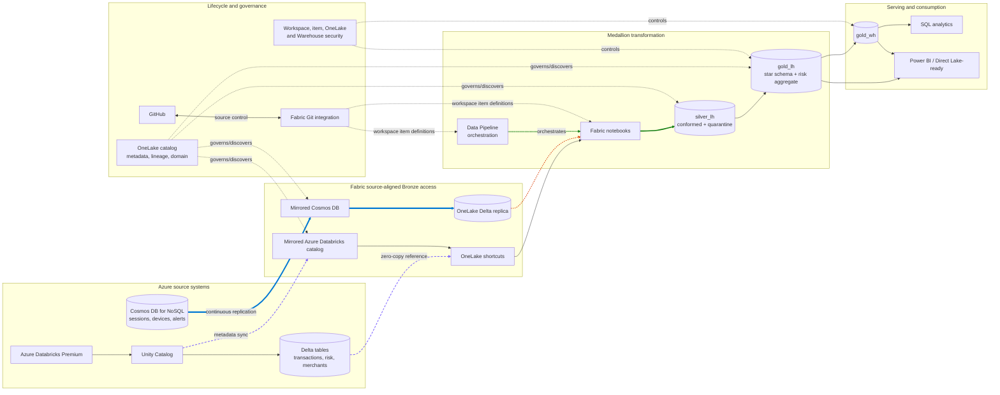

# Architecture

## Design summary

The POC uses two source-aligned Bronze mechanisms instead of forcing both sources through a duplicate landing Lakehouse. Databricks retains its single copy of Delta data and exposes it through metadata mirroring plus shortcuts. Cosmos DB mirroring maintains a continuous Delta replica in OneLake. Fabric notebooks then materialize conformed Silver tables and a cross-source Gold star schema.

Legend: purple dashed lines are metadata/zero-copy shortcut access; blue double lines are physical replication; green solid lines are transformations/materialization; orange dashed lines are orchestration. Governance and Git lines describe control-plane relationships, not data movement.

## Source-aligned Bronze decision

`databricks_bronze` and `cosmos_bronze` are logical source-aligned layers, not equivalent storage implementations.

| Source | Bronze representation | Physical copy in OneLake? | Reason |
|---|---|---:|---|
| Databricks | Mirrored Unity Catalog metadata plus table shortcuts | No | Preserves zero-copy access and the source Delta single version of truth |
| Cosmos DB | Mirrored database represented as Delta tables | Yes | Fabric Mirroring continuously applies source inserts, updates, and deletes for analytics |

The first intentional duplicate/materialized layer is `silver_lh`. It earns that cost by enforcing types, normalizing names/timestamps, deduplicating, flattening useful nested fields, validating relationships, adding lineage, and quarantining invalid records.

## Source lineage

| Source object | Access path | Silver | Gold/serving |
|---|---|---|---|
| Databricks `transactions` | Unity Catalog metadata → shortcut | `transactions`, `quarantine_transactions` | `FactTransactions`, `DimAccount`, `DimCustomer`, `DimDate`, risk profile |
| Databricks `transaction_risk` | Unity Catalog metadata → shortcut | `transaction_risk`, `quarantine_transaction_risk` | `FactTransactions`, risk profile |
| Databricks `merchants` | Unity Catalog metadata → shortcut | `merchants`, `quarantine_merchants` | `DimMerchant` |
| Cosmos `digitalSessions` | Continuous mirror → Delta replica | `sessions`, `quarantine_sessions` | `FactDigitalSessions`, risk profile |
| Cosmos `devices` | Continuous mirror → Delta replica | `devices`, `quarantine_devices` | `DimDevice`, risk profile |
| Cosmos `fraudAlerts` | Continuous mirror → Delta replica | `fraud_alerts`, `quarantine_fraud_alerts` | `FactFraudAlerts`, risk profile |

Every Silver row receives `source_system`, `pipeline_run_id`, `run_date`, and `silver_loaded_at`. Gold rows receive the run identifiers and `gold_loaded_at`. The `reconciliation_results` table records source/Silver/Gold/quarantine comparisons and the cross-source alert-to-transaction relationship.

## Pipeline and retry behavior

`pl_multisource_medallion` logs pipeline start, validates Databricks and Cosmos in parallel, then runs Silver → Gold → Warehouse publication → reconciliation → success logging. Each material stage has a failure dependency path that records the failed stage and available error message.

Silver and Gold are deterministic full-refresh writes for POC-scale data. Audit and reconciliation records use Delta merge keys so a retry of the same `pipeline_run_id` is idempotent. The source generators and incremental jobs are deterministic and use upsert/replace semantics.

## Data model and cross-source calculation

`AggCustomerRiskProfile` is keyed by `CustomerID`/`CustomerSK` and uses independent source-relative 30-day watermarks. This prevents asynchronous source clocks from silently excluding one source. The score weights transaction risk, fraud alerts, failed logins, untrusted devices, and non-US session observations, capped at 100 and banded Low/Medium/High. It is a transparent POC heuristic, not a production fraud model.

## Partition design

All Cosmos containers use the hierarchical business key `/customerId` as a single hash partition key. The expected operational and analytical access pattern is customer-centric: retrieve a customer's sessions/devices/alerts, apply a customer-scoped upsert, and join all containers with Databricks on `CustomerID`.

Benefits:

- high-cardinality distribution across the intended customer population;
- single-partition customer investigations and transactional batches;
- a consistent cross-container business key for Fabric conformance.

Tradeoffs:

- global searches by `transactionId`, `deviceId`, severity, time, or alert status are cross-partition queries;
- a disproportionately active customer can create a hot logical partition;
- the key is immutable, so reassignment requires delete/recreate;
- the POC's small 100-customer Cosmos seed is not evidence of production-scale distribution.

No Fabric-side custom partitioning is assumed: current Cosmos mirroring documentation says custom partitioning isn't supported. Silver/Gold use POC-scale overwrite writes rather than physical date partitioning. At production scale, measure file sizes and query pruning first, then consider date-based layout/optimization for large facts; avoid high-cardinality partitions such as `TransactionID` that create many small files.

## Security boundaries

Unity Catalog permissions are not mirrored into Fabric. The credential used for the mirrored Databricks connection authorizes source discovery/access, while Fabric workspace, item, and OneLake policies must be configured independently. Cosmos source authentication and Fabric target authorization are also separate boundaries. See [docs/governance-security.md](docs/governance-security.md).

## Current deployment boundary

Local definitions and tests exist, but the live architecture is not yet end-to-end verified. Databricks metastore external data access is enabled and source execution is being validated. Cosmos uses the private-endpoint route; its network and Fabric VNet gateway prerequisites are deployed, while the interactive OAuth connection remains to be completed. Fabric source items, transformations, serving, Git, and governance remain unverified until their acceptance checks pass.
